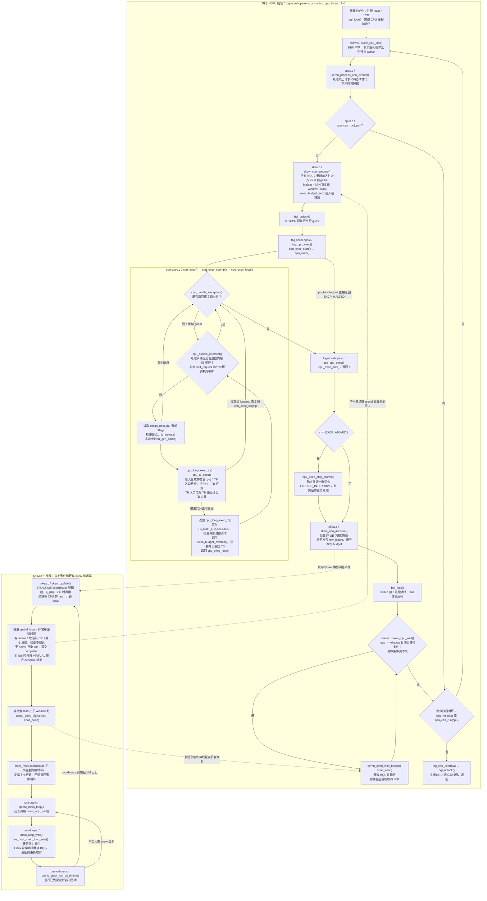
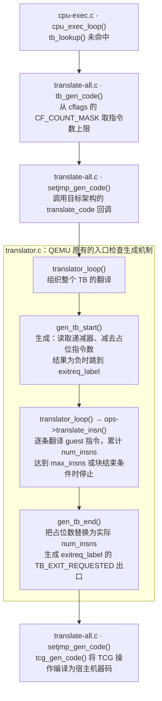
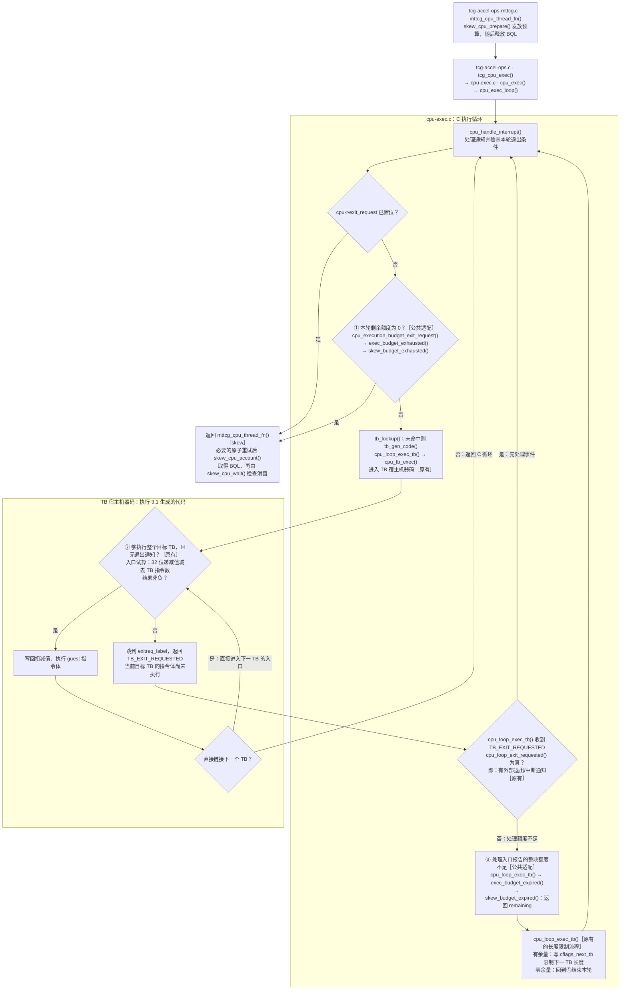

# Skew 代码 Wiki

Skew 在 MTTCG 下限制各 vCPU 的领先量。**TB 消耗 budget，vCPU 线程等待 window，主线程推进 global。**
本文对应当前实现；详细设计见 [DESIGN_zh.rst](DESIGN_zh.rst)，实测性能见 [文档入口](README.md)。

## 1. 从窗口配置到执行额度

### 1.1 启动时设置窗口

Skew 通过 QEMU 的 `-accel` 选项配置。下面是启动命令中的加速器参数片段：

```sh
-accel tcg,thread=multi,skew=1000000,skew-ips=1000000000
```

| 参数 | 含义 | 示例值 |
|---|---|---|
| `thread=multi` | 每个 vCPU 使用独立的 TCG 执行线程 | 开启多线程执行 |
| `skew` | 允许 vCPU 领先全局虚拟时间的最大时间窗口，单位纳秒 | 1,000,000 ns，即 1 ms |
| `skew-ips` | 模拟时间的换算速率，单位为指令/模拟秒 | 每 10 亿条指令对应 1 秒模拟时间 |

代码按指令数限制执行，因此 `skew_init()` 把时间窗口换算成指令窗口：

```text
window = floor(skew × skew-ips / 1,000,000,000)
       = 1,000,000 条指令              // 上面这组参数
```

`window` 表示一个 CPU 最多可以领先全局逻辑进度多少条指令。
随着全局进度前进，允许该 CPU 执行到的位置也向前移动，这就是滑动窗口。

### 1.2 一轮执行与 budget

每个 vCPU 线程反复执行“分配额度 → 执行 guest 代码 → 结算完成量”。
本文把这个过程称为**一轮执行**，代码对应：

```text
skew_cpu_prepare() → tcg_cpu_exec() → skew_cpu_account()
```

`budget` 是这一轮允许执行的指令数。TCG 用递减器保存剩余额度 `remaining`，
执行代码时扣减它。一轮可以跨越多个翻译块（TB），也可能因中断或 halt 等提前结束。

当前递减器的额度字段是 `cpu->neg.icount_decr.u16.low`，宽度为 **16 位无符号整数**，
可表示 0～65,535。因此，一次写入递减器的额度最多为 `UINT16_MAX = 2^16 - 1 = 65,535`。
这个存储上限与剩余窗口共同决定 budget：

```text
本轮 budget = MIN(65,535, 当前剩余窗口)
```

剩余窗口只有 70 条，就发放 70 条；剩余窗口有 100 万条，就先发放 65,535 条。
后一种情况在本轮结束后重新计算窗口余量，再发放下一轮额度。

### 1.3 如何计算剩余窗口

以下进度、差值和额度均以**指令数**表示。
`active` 表示 CPU 当前参与全局进度协调；CPU 从空闲恢复执行时重新加入。
`raw_icount` 是 `cpu->skew_raw_icount` 的简写，`budget` 对应 `cpu->skew_budget`。

| 量 | 含义与更新时机 |
|---|---|
| `raw_icount` | 该 CPU 累计完成并已结算的指令数，在 account 时增加，跨多次活跃期保留。 |
| `skew_raw_base` | 该 CPU 本次加入 active 集合时保存的 raw 快照，用来扣除此前的执行历史。 |
| `skew_logical_base` | 本次加入时保存的 global，作为这段活跃期的逻辑起点；与 raw_base 配对更新。 |
| `local` | 该 CPU 当前已发布的逻辑进度：逻辑起点加上本次活跃期已结算的指令增量。 |
| `global_icount` | 所有 CPU 共用的全局逻辑进度，由主线程的 `skew_update()` 推进。正常取活跃成员最小进度，全 idle 时提交已完成尾部，均不倒退。 |
| `lead` | 该 CPU 的 local 比当前 global 领先多少条指令。prepare 时要求 `0 <= lead <= window`。 |
| `window` | 初始化时由启动参数换算出的最大领先指令数。 |
| `UINT16_MAX` | 递减器一次可保存的最大额度：65,535。 |
| `budget` | prepare 发放并保存在 `skew_budget` 中的本轮额度，同时写入递减器。 |
| `remaining` | 递减器中的当前剩余额度，执行时减少；account 使用 `budget - remaining` 计算本轮完成量。 |

```c
local  = skew_logical_base + raw_icount - skew_raw_base;
lead   = local - global_icount;
budget = MIN(UINT16_MAX, window - lead);
```

三步依次得到**逻辑进度、领先量、本轮额度**；`window - lead` 就是当前剩余窗口。

用一组较小的数值说明：某 CPU 加入时保存 `skew_raw_base=1000`、
`skew_logical_base=5000`。后来它已结算到 `raw_icount=1080`，
全局进度为 `global_icount=5050`，窗口为 `window=100`：

```text
local  = 5000 + (1080 - 1000) = 5080
lead   = 5080 - 5050         = 30
budget = MIN(65535, 100 - 30) = 70
```

本次活跃期已完成 80 条，当前领先全局 30 条，所以本轮还可执行 70 条。
若执行期间 global 保持不变，这 70 条执行完后就到达窗口边界，需要等待 global 前进。

## 2. TCG loop 中的完整路径

下面按 **skew 已开启、MTTCG 正在运行**画出调用路径。实线表示同一线程内的执行顺序，
虚线表示两个线程间的数据读取或唤醒。节点中的文件名对应本节末尾的源码入口。



`skew_cpu_wait()` 的完整等待条件是：CPU 仍为 `active`，没有 `stop`、`halted`，
VM 正在运行，CPU 工作队列为空，没有 `exit_request`，并且 `local - global_icount == window`。
每次醒来都会重新检查这些条件；睡眠期间仍属于 active 集合。
协调器推进 global 后可以唤醒它，停止请求或新的 CPU 工作也可以使它结束等待。

一次 `tcg_cpu_exec()` 可以执行多个 TB，TB 之间还可以直接跳转。
**TB 返回 C 循环，不等于返回 vCPU 线程循环**：只有 `tcg_cpu_exec()` 返回之后，
才执行本轮 `skew_cpu_account()` 和 `skew_cpu_wait()`。三个预算检查位置在第 3 节展开。
图中省略了 CPU 执行入口/出口的辅助处理；异常的 `longjmp` 路径会先完成清理，再重新进入执行循环。

原子重试原本就在 MTTCG 的 `switch (r)` 中。Skew 将它放到结算之前，
使重试使用本轮额度并统一计数；局部返回码改为 `EXCP_INTERRUPT`，不向 guest 注入中断。

主线程通过 `timer_mod()` 安排下一次协调器回调，**不会直接调用下一轮 `skew_update()`**。
BQL 保护 active 集合、global 和等待状态；guest 执行期间已经释放 BQL，
所以协调器仍需原子读取各 vCPU 发布的 raw。

| 图中源码入口 | 职责 |
|---|---|
| [tcg-accel-ops-mttcg.c](../../accel/tcg/tcg-accel-ops-mttcg.c)：`mttcg_cpu_thread_fn()` | 串起事件处理、额度准备、执行、结算、等待与线程退出。 |
| [tcg-accel-ops.c](../../accel/tcg/tcg-accel-ops.c)：`tcg_cpu_exec()` | 用 `cpu_exec_start/end()` 包围 CPU 执行。 |
| [cpu-exec.c](../../accel/tcg/cpu-exec.c)：`cpu_exec_loop()`、`cpu_loop_exec_tb()` | 公共异常/中断循环、TB 查找与执行、预算退出处理。 |
| [skew.c](../../accel/tcg/skew.c)：`skew_cpu_*()`、`skew_update()` | 管理 skew 的额度、执行量、窗口等待和全局时间。 |
| [cpus.c](../../system/cpus.c)：`qemu_process_cpu_events()`、`cpu_can_run()` | 公共 CPU 事件与运行状态判断。 |
| [runstate.c](../../system/runstate.c)：`qemu_main_loop()`；[main-loop.c](../../util/main-loop.c)：`main_loop_wait()` | 主线程等待宿主事件并调度定时器。 |
| [qemu-timer.c](../../util/qemu-timer.c)：`qemu_clock_run_all_timers()` | 检查到期时间并调用定时器回调。 |

## 3. budget 如何阻止 TB 跑出窗口

**TB 入口的递减、负值检查和退出代码是 QEMU 原有机制。**
本次改动让 skew 通过公共 budget 接口使用它，窗口计算、结算和等待由 skew 负责。

下面把“翻译时生成检查”和“运行时执行检查”分开画。
标号 ①②③ 使用同一份 `remaining`，分别表示整轮耗尽判断、整块容量判断、入口拒绝后的处理。
图中展示启用预算的普通 TB 路径，其他异常及 `CF_NOIRQ` 特殊路径省略。

### 3.1 翻译阶段：QEMU 在哪里生成入口检查

这一阶段在需要生成 TB 时执行。`gen_tb_start()` 是生成代码的函数，
它生成的检查指令位于 TB 入口，随这个 TB 的每次运行执行。



入口生成代码的关键位置：

| 源码入口 | 生成什么 |
|---|---|
| [gen_tb_start()](../../accel/tcg/translator.c) | `tcg_gen_ld_i32()` 读取递减值；`tcg_gen_sub_i32()` 生成减法；`tcg_gen_brcondi_i32(TCG_COND_LT, ...)` 生成负值跳转。检查通过后才写回剩余额度。 |
| [gen_tb_end()](../../accel/tcg/translator.c) | `tcg_set_insn_param()` 填入实际 TB 指令数；`tcg_gen_exit_tb(tb, TB_EXIT_REQUESTED)` 生成返回 C 执行路径的出口。 |

### 3.2 执行阶段：从 vCPU 线程到 TB，再返回 C 循环

图中的标签用于区分职责：**原有**为 QEMU 原有执行机制，**公共适配**为预算接口接入，
**skew**为本时间模型的实现；同一个函数可以保留原有流程并调用新接口。



`cpu_loop_exit_requested()` 位于 [cpu-common.h](../../include/exec/cpu-common.h)；
`exec_budget_*()` 位于 [exec-budget.h](../../include/exec/exec-budget.h)；
`skew_budget_*()` 位于 [skew.c](../../accel/tcg/skew.c)。

| 标号 | 关注的问题 | 剩余 3 条、目标 TB 为 10 条时 |
|---|---|---|
| ① 整轮耗尽判断 | remaining 是否已经为 0？ | 还有 3 条，继续尝试执行。 |
| ② 整块容量判断 | remaining 能否容纳目标 TB 的全部指令？ | 3 小于 10，入口返回，目标 TB 指令体尚未执行。 |
| ③ 不足后的处理 | 如何利用入口返回时剩下的额度？ | 回调返回 3，公共层把下一 TB 长度限制为 3 条。 |

③ 是对②返回结果的处理。执行完这 3 条后，后续入口检查或返回 C 循环，
最终由①发现 remaining 为 0，结束本轮。TB 直连可以直接进入下一 TB 的②，
只有返回 C 执行循环时才再次经过①。

图中两个“退出”层次分别是：

| 图中条件 | 代码接口与判断 | 成立后的动作 |
|---|---|---|
| `cpu->exit_request` 已置位 | `cpu_handle_interrupt()` 使用 `qatomic_load_acquire(&cpu->exit_request)` 读取 | 请求结束本轮 `tcg_cpu_exec()`，返回 vCPU 线程处理。 |
| 本轮剩余预算为 0（remaining == 0） | `cpu_execution_budget_exit_request()` → `exec_budget_exhausted()` → `skew_budget_exhausted()` | 额度用完，结束本轮，随后 account 结算、wait 检查窗口。 |
| 有外部退出/中断通知 | `cpu_loop_exec_tb()` 调用 `cpu_loop_exit_requested()`，检查递减器 32 位值的符号位 | 先离开 TB 执行链，回到 `cpu_handle_interrupt()` 处理事件；处理后可能继续执行。 |

“外部退出/中断通知”用于让正在执行的 CPU 及时检查事件，例如暂停请求、待办工作或中断。
原代码也称它为异步退出：通知可能来自其他并行线程，预算有余量时也能触发。
递减器的低 16 位保存 remaining，高 16 位用于这类通知。
`cpu_loop_exit_requested()` 的具体判断位于 [cpu-common.h](../../include/exec/cpu-common.h)：

```c
return (int32_t)qatomic_read(&cpu->neg.icount_decr.u32) < 0;
```

如果这个判断成立，`cpu_loop_exec_tb()` 先返回 C 执行循环处理事件；
否则才调用 `exec_budget_expired()` 处理预算不足。
`cpu_handle_interrupt()` 汇聚本轮退出条件的代码是：

```c
if (qatomic_load_acquire(&cpu->exit_request) ||
    cpu_execution_budget_exit_request(cpu)) {
    /* 标记退出原因，并让 CPU 执行循环结束本轮。 */
    ...
}
```

[translator.c](../../accel/tcg/translator.c) 的 `gen_tb_start()` 生成额度检查，
`gen_tb_end()` 在翻译结束后填入 TB 指令数。普通路径先检查、再写回扣减值，
TB 直连也经过目标 TB 的入口。特殊 `CF_NOIRQ` 路径由上层保证额度，图中未展开。

③通过设置 `cflags_next_tb` 限制下一 TB 的长度。
Skew 的 `expired` 回调不补充额度；remaining 为 0 后，`exhausted` 返回 true，退出本轮。
异常或提前退出涉及 TB 状态恢复时，[translate-all.c](../../accel/tcg/translate-all.c)
退还尚未执行的额度，结算使用修正后的 remaining。

`cpu_execution_budget_exit_request()` 的首个 return 是非计数 TB 的例外：
显式指定下一 TB 不带 `CF_USE_ICOUNT` 时，不让零预算拦住它。
普通执行仍检查 budget，外部退出条件单独汇聚。

## 4. skew.c：时间模型与窗口管理

源码：[skew.c](../../accel/tcg/skew.c)。`raw` 是原子发布的已完成指令数，
未结算的本轮进度暂不进入协调器采样。

### 初始化与时钟读取

- `skew_init()`：校验参数、换算 window，安装迁移阻止器，创建 REALTIME 定时器。
- `skew_vm_state()`：暂停时撤销定时器，恢复时立即安排更新。
- `skew_get_clock()`：原子读取 `virtual_ns`；QOM getter 提供时钟和各 CPU raw 的只读观测。

迁移阻止器向 QEMU 登记“不支持保存该运行状态”的原因；迁移或 VM 状态快照请求被拒绝。
它不锁住 vCPU。当前 skew 状态尚未实现完整的保存/恢复协议。

### 每个 CPU 的四个动作

| 函数 | 作用 | BQL |
|---|---|---|
| `skew_cpu_idle()` | 仅在 stop、真实 idle 或 VM 停机时清除 active | 调用者持有 |
| `skew_cpu_prepare()` | 必要时重新对齐，检查 lead，保存 global 快照并发放 budget | 调用者持有 |
| `skew_cpu_account()` | 计算 `executed = budget - remaining`，检查后原子累加 raw，再清零额度 | 正常结算不持有；复位路径也可调用 |
| `skew_cpu_wait()` | 窗口已满时条件变量睡眠，醒来重查所有条件 | 进入时持有，睡眠时释放 |

重新对齐只发生在 inactive → active：

```c
skew_raw_base = raw_icount;
skew_logical_base = global_icount;  /* 此时 local == global */
```

累计 raw 不变，也不直接修改 guest 可见的共享虚拟时钟。
普通预算续领、窗口等待都保持 active，不会每轮重新对齐。

越界防护在 prepare 和 account 中始终生效，不依赖 assert。
account 使用发放时保存的 `skew_budget_global`，既避免无锁读取正在变化的 global，
也防止 global 后续推进掩盖本轮越界。异常打印 CPU/窗口/预算信息并终止 QEMU。
检测基于现有计数，不能发现底层完全漏记的指令。

### skew_update：推进共享时间

主线程通过一个宿主定时器周期性调用 `skew_update()`，采样各 CPU 的进度。
调用间隔由 `-accel` 的 `skew-update` 参数设置，单位为宿主纳秒；例如
`skew-update=100000` 表示通常在一次回调结束后约 100 μs 安排下一次更新。
它保存在 `update_interval` 中，用于安排协调回调；执行额度仍由第 1 节的剩余窗口公式计算。

每次回调做五件事：

1. 扫描各 CPU 的已发布 local。有 active 时，`global = MAX(old_global, MIN(active local))`。
2. 没有 active 且所有 CPU 线程确实 idle 时，取 `completed = MAX(old_global, 所有 local)`，提交最后执行尾部。
3. 发布 `virtual_ns = warp_ns + global × 10^9 / sim_ips`，用断言检查时间不倒退。
4. 全 idle 时查询最近 VIRTUAL deadline；若大于 0，累加 warp 并推进虚拟时间，再通知虚拟时钟处理路径。
5. 唤醒窗口重新有余量的 CPU，重新安排 coordinator。

全 idle 取 completed，是为了提交已经完成的尾部。CPU 恢复时通过 prepare 对齐到新 global。
窗口等待者仍是 active，不能误触发空闲跳时。

coordinator 属于 `QEMU_CLOCK_REALTIME`；deadline 查询只看 `QEMU_CLOCK_VIRTUAL`，
不会把 coordinator 自己算进去。查询 deadline 本身不执行定时器回调。

回调由主事件循环持有 BQL 执行；BQL 保护成员、基准和 global，
但不会停止并行执行 guest 的 MTTCG 线程，所以 raw 仍需原子读写。
更新周期按宿主时间安排，主线程忙时可能延迟；预算检查仍负责限制执行上界。
代码在 `!active && deadline < 0` 时把下一次轮询间隔下限设为 10 ms，减少空转。

## 5. 从 icount 抽出的公共 budget

[exec-budget.h](../../include/exec/exec-budget.h) 是接口与适配层：
复用 TCG 的额度递减和退出设施，不保存某一种时间模型的时钟状态。

```text
CPU 执行循环 → exec_budget_* → 当前 CPU 的 execution_budget_ops
                                 ├─ icount_budget_ops
                                 └─ skew_budget_ops
```

[tcg_cpu_init_cflags()](../../accel/tcg/tcg-accel-ops.c) 在初始化时选择回调表。
普通 MTTCG 使用 NULL；icount 和 skew 互斥。预算启用时为 TB 设置 `CF_USE_ICOUNT`。

| 公共接口/回调 | 公共层的职责 | icount 实现 | skew 实现 |
|---|---|---|---|
| `set / remaining` | 装载、读取 16 位额度 | 共用 | 共用 |
| `exhausted` | 判断是否结束本轮 | remaining 加私有 extra 为 0 | remaining 为 0 |
| `expired` | TB 无法在当前额度内执行时派发 | `icount_update()` 后续配长预算 | 返回当前 remaining，不推进时间、不续领窗口 |
| `before_reset` | 清除执行状态前给模型结算机会 | 未注册 | `skew_cpu_account()` |

[tcg-accel-ops-icount.c](../../accel/tcg/tcg-accel-ops-icount.c) 因而需要改动：
它通过 `icount_refill_budget()` 把私有长预算分成公共额度和 `icount_extra`，
并把原本位于公共执行路径中的 icount 到期处理收回自己的回调。
预算生成、时间更新和 replay 结算仍由 icount 管理；这里没有 `skew_enabled()` 分支。

Skew 使用自己的 `skew_budget`、raw、基准和 global，不使用 `icount_budget/icount_extra`。
底层字段 `icount_decr`、标志 `CF_USE_ICOUNT` 保留了历史命名：
低 16 位承载执行额度，高 16 位用于异步退出通知；当前没有对整套 TCG 底层做全面重命名。

## 6. 按这个顺序读代码

1. [tcg-accel-ops-mttcg.c](../../accel/tcg/tcg-accel-ops-mttcg.c)：线程中 prepare → exec → account → wait 的顺序。
2. [cpu-exec.c](../../accel/tcg/cpu-exec.c)：`cpu_exec_loop()`、`cpu_loop_exec_tb()` 与退出条件汇聚。
3. [translator.c](../../accel/tcg/translator.c)：TB 入口的实际额度检查。
4. [skew.c](../../accel/tcg/skew.c)：滑窗、时间推进、对齐与等待。
5. [exec-budget.h](../../include/exec/exec-budget.h) 与 [icount 适配](../../accel/tcg/tcg-accel-ops-icount.c)：公共协议及两种模型的分工。
