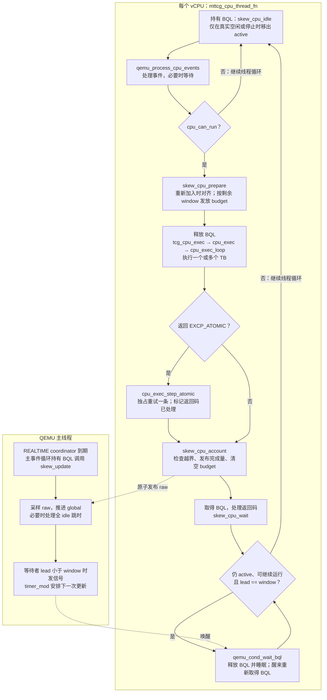
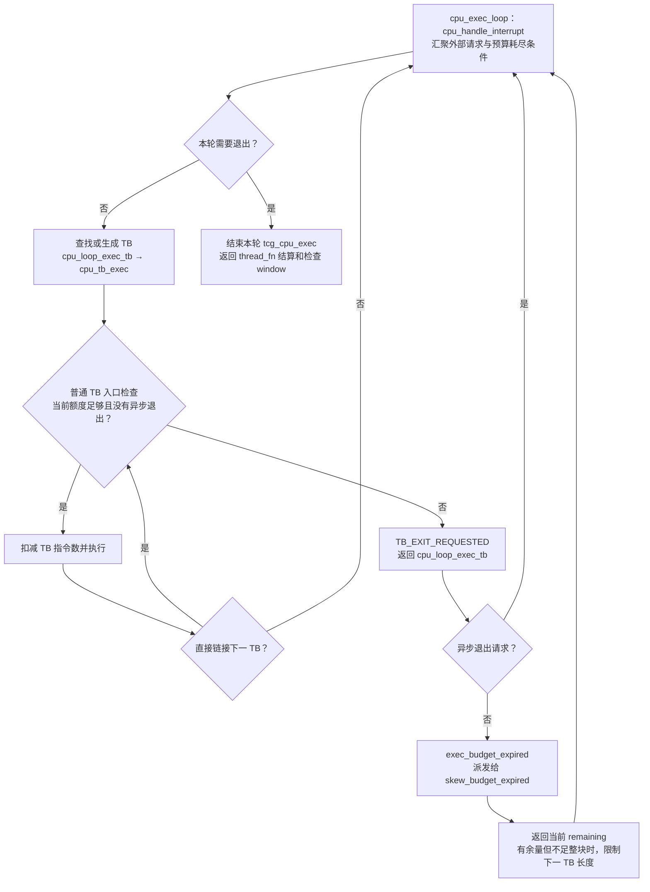

# Skew 代码 Wiki

Skew 在 MTTCG 下限制各 vCPU 的领先量。**TB 消耗 budget，vCPU 线程等待 window，主线程推进 global。**
本文对应当前实现；详细设计见 [DESIGN_zh.rst](DESIGN_zh.rst)，实测性能见 [文档入口](README.md)。

## 1. 公式中的量

以下公式针对一个 vCPU。进度、差值和额度都以**指令数**表示，不是纳秒。
`raw_icount` 是代码中 `cpu->skew_raw_icount` 的简写；`budget` 对应 `cpu->skew_budget`。

| 量 | 含义与更新时机 |
|---|---|
| `raw_icount` | 该 CPU 累计完成并已结算的指令数。account 时增加，重新加入 active 集合时不清零；尚未结算的执行量不在其中。 |
| `skew_raw_base` | 该 CPU 本次加入 active 集合时保存的 raw 快照，用来扣除此前执行的历史。 |
| `skew_logical_base` | 本次加入时保存的 global，作为这段活跃期的逻辑起点。与 raw_base 配对更新，不随每次发放预算变化。 |
| `local` | 该 CPU 当前已发布的逻辑进度：逻辑起点加上本次活跃期已结算的指令增量。它不是该 CPU 的累计 raw，也不是 guest 时间寄存器值。 |
| `global_icount` | 所有 CPU 共用的全局逻辑进度，由主线程的 `skew_update()` 推进；不是各 CPU 指令数之和。正常取活跃成员最小进度，全 idle 时提交已完成尾部，均不倒退。 |
| `lead` | 该 CPU 的 local 比当前 global 领先多少条指令。prepare 时要求 `0 <= lead <= window`。 |
| `window` | 允许领先 global 的最大指令数，初始化时由命令行的窗口纳秒值与 IPS 换算得到。 |
| `UINT16_MAX` | 常量 65,535：底层 16 位执行额度一次能装载的最大值，不是新的调度参数。 |
| `budget` | prepare 为本轮发放的指令额度，装入 TCG 递减器。`skew_budget` 保存发放值，实际执行时递减的是 remaining，供 account 计算本轮完成量。 |

```c
local  = skew_logical_base + raw_icount - skew_raw_base;
lead   = local - global_icount;
budget = MIN(UINT16_MAX, window - lead);
```

三步分别表示：**把 raw 增量映射到共同逻辑进度 → 算出领先量 → 发放剩余窗口内的额度**。
`MIN` 取两者较小值；`window - lead` 是当前剩余窗口。

例如，某 CPU 加入时保存 `skew_raw_base=1000`、`skew_logical_base=5000`。
后来它已结算到 `raw_icount=1080`，协调器已把 `global_icount` 推进到 5050，且 `window=100`：

```text
local  = 5000 + (1080 - 1000) = 5080
lead   = 5080 - 5050         = 30
budget = MIN(65535, 100 - 30) = 70
```

它累计 raw 为 1080，但本次活跃期只增加了 80 条；现在领先 global 30 条，
所以本轮最多再执行 70 条。若执行期间 global 不再前进，额度用完就到窗口边界。
若剩余窗口超过 65,535 条，则分批装载预算，批次用完不一定需要睡眠。

命令行 `skew` 以纳秒给出，初始化时换算成 `window`；`skew-ips` 决定换算比例。
`skew-update` 只决定宿主协调频率，不参与预算生成。当前没有 quantum。

## 2. TCG loop 中的完整路径

这里的 `thread_fn` 是每个 vCPU 的 `mttcg_cpu_thread_fn()`；
`cpu_loop` 指它调用的 `cpu_exec_loop()`，不是主线程的事件循环。



图中省略线程初始化和热拔出收尾。线程是否继续仍由原有 `unplug/cpu_can_run` 条件决定。

一次 `tcg_cpu_exec()` 可以执行多个 TB，直连 TB 也包含在内。
预算耗尽、外部退出请求、halt、调试或原子重试等都可能让它提前返回。
因此 `skew_cpu_wait()` 的频率是**每轮执行返回后**，不是每条指令或每个 TB。

原子重试原本就在 MTTCG 的 `switch (r)` 中。Skew 把它提前到结算之前，
让重试使用本轮额度，再统一计数；修改局部返回码避免重复重试，不向 guest 注入中断。

## 3. budget 如何阻止 TB 跑出窗口

下图聚焦普通预算退出路径，省略其他异常处理分支。



[translator.c](../../accel/tcg/translator.c) 的 `gen_tb_start()` 生成额度检查，
`gen_tb_end()` 在翻译结束后填入 TB 指令数。普通路径先检查、再写回扣减值，
TB 直连也经过目标 TB 的入口。特殊 `CF_NOIRQ` 路径由上层保证额度，图中未展开。

剩余 3 条而下一 TB 有 10 条时，公共循环设置 `cflags_next_tb`，限制下一 TB 为 3 条。
Skew 的 `expired` 回调不补充额度；remaining 为 0 后，`exhausted` 返回 true，退出本轮。
异常或提前退出涉及 TB 状态恢复时，[translate-all.c](../../accel/tcg/translate-all.c)
退还尚未执行的额度，结算使用修正后的 remaining。

`cpu_execution_budget_exit_request()` 的首个 return 是非计数 TB 的例外：
显式指定下一 TB 不带 `CF_USE_ICOUNT` 时，不让零预算拦住它。
普通执行仍检查 budget，外部退出条件单独汇聚。

## 4. skew.c：时间模型与窗口管理

源码：[skew.c](../../accel/tcg/skew.c)。`raw` 是原子发布的已完成指令数，
未结算的本轮进度暂不进入协调器采样。

### 初始化与时钟读取

- `skew_init()`：校验参数、换算 window，安装迁移阻止器，创建 REALTIME 定时器。
- `skew_vm_state()`：暂停时撤销定时器，恢复时立即安排更新。
- `skew_get_clock()`：原子读取 `virtual_ns`；QOM getter 提供时钟和各 CPU raw 的只读观测。

迁移阻止器向 QEMU 登记“不支持保存该运行状态”的原因；迁移或 VM 状态快照请求被拒绝。
它不锁住 vCPU。当前 skew 状态尚未实现完整的保存/恢复协议。

### 每个 CPU 的四个动作

| 函数 | 作用 | BQL |
|---|---|---|
| `skew_cpu_idle()` | 仅在 stop、真实 idle 或 VM 停机时清除 active | 调用者持有 |
| `skew_cpu_prepare()` | 必要时重新对齐，检查 lead，保存 global 快照并发放 budget | 调用者持有 |
| `skew_cpu_account()` | 计算 `executed = budget - remaining`，检查后原子累加 raw，再清零额度 | 正常结算不持有；复位路径也可调用 |
| `skew_cpu_wait()` | 窗口已满时条件变量睡眠，醒来重查所有条件 | 进入时持有，睡眠时释放 |

重新对齐只发生在 inactive → active：

```c
skew_raw_base = raw_icount;
skew_logical_base = global_icount;  /* 此时 local == global */
```

累计 raw 不变，也不直接修改 guest 可见的共享虚拟时钟。
普通预算续领、窗口等待都保持 active，不会每轮重新对齐。

越界防护在 prepare 和 account 中始终生效，不依赖 assert。
account 使用发放时保存的 `skew_budget_global`，既避免无锁读取正在变化的 global，
也防止 global 后续推进掩盖本轮越界。异常打印 CPU/窗口/预算信息并终止 QEMU。
检测基于现有计数，不能发现底层完全漏记的指令。

### skew_update：推进共享时间

每次回调做五件事：

1. 扫描各 CPU 的已发布 local。有 active 时，`global = MAX(old_global, MIN(active local))`。
2. 没有 active 且所有 CPU 线程确实 idle 时，取 `completed = MAX(old_global, 所有 local)`，提交最后执行尾部。
3. 发布 `virtual_ns = warp_ns + global × 10^9 / sim_ips`，用断言检查时间不倒退。
4. 全 idle 时查询最近 VIRTUAL deadline；若大于 0，累加 warp 并推进虚拟时间，再通知虚拟时钟处理路径。
5. 唤醒窗口重新有余量的 CPU，重新安排 coordinator。

全 idle 取 completed，是为了提交已经完成的尾部。CPU 恢复时通过 prepare 对齐到新 global。
窗口等待者仍是 active，不能误触发空闲跳时。

coordinator 属于 `QEMU_CLOCK_REALTIME`；deadline 查询只看 `QEMU_CLOCK_VIRTUAL`，
不会把 coordinator 自己算进去。查询 deadline 本身不执行定时器回调。

回调由主事件循环持有 BQL 执行；BQL 保护成员、基准和 global，
但不会停止并行执行 guest 的 MTTCG 线程，所以 raw 仍需原子读写。
更新周期按宿主时间安排，主线程忙时可能延迟；预算检查仍负责限制执行上界。
代码在 `!active && deadline < 0` 时把下一次轮询间隔下限设为 10 ms，减少空转。

## 5. 从 icount 抽出的公共 budget

[exec-budget.h](../../include/exec/exec-budget.h) 是接口与适配层：
复用 TCG 的额度递减和退出设施，不保存某一种时间模型的时钟状态。

```text
CPU 执行循环 → exec_budget_* → 当前 CPU 的 execution_budget_ops
                                 ├─ icount_budget_ops
                                 └─ skew_budget_ops
```

[tcg_cpu_init_cflags()](../../accel/tcg/tcg-accel-ops.c) 在初始化时选择回调表。
普通 MTTCG 使用 NULL；icount 和 skew 互斥。预算启用时为 TB 设置 `CF_USE_ICOUNT`。

| 公共接口/回调 | 公共层的职责 | icount 实现 | skew 实现 |
|---|---|---|---|
| `set / remaining` | 装载、读取 16 位额度 | 共用 | 共用 |
| `exhausted` | 判断是否结束本轮 | remaining 加私有 extra 为 0 | remaining 为 0 |
| `expired` | TB 无法在当前额度内执行时派发 | `icount_update()` 后续配长预算 | 返回当前 remaining，不推进时间、不续领窗口 |
| `before_reset` | 清除执行状态前给模型结算机会 | 未注册 | `skew_cpu_account()` |

[tcg-accel-ops-icount.c](../../accel/tcg/tcg-accel-ops-icount.c) 因而需要改动：
它通过 `icount_refill_budget()` 把私有长预算分成公共额度和 `icount_extra`，
并把原本位于公共执行路径中的 icount 到期处理收回自己的回调。
预算生成、时间更新和 replay 结算仍由 icount 管理；这里没有 `skew_enabled()` 分支。

Skew 使用自己的 `skew_budget`、raw、基准和 global，不使用 `icount_budget/icount_extra`。
底层字段 `icount_decr`、标志 `CF_USE_ICOUNT` 保留了历史命名：
低 16 位承载执行额度，高 16 位用于异步退出通知；当前没有对整套 TCG 底层做全面重命名。

## 6. 按这个顺序读代码

1. [tcg-accel-ops-mttcg.c](../../accel/tcg/tcg-accel-ops-mttcg.c)：线程中 prepare → exec → account → wait 的顺序。
2. [cpu-exec.c](../../accel/tcg/cpu-exec.c)：`cpu_exec_loop()`、`cpu_loop_exec_tb()` 与退出条件汇聚。
3. [translator.c](../../accel/tcg/translator.c)：TB 入口的实际额度检查。
4. [skew.c](../../accel/tcg/skew.c)：滑窗、时间推进、对齐与等待。
5. [exec-budget.h](../../include/exec/exec-budget.h) 与 [icount 适配](../../accel/tcg/tcg-accel-ops-icount.c)：公共协议及两种模型的分工。
