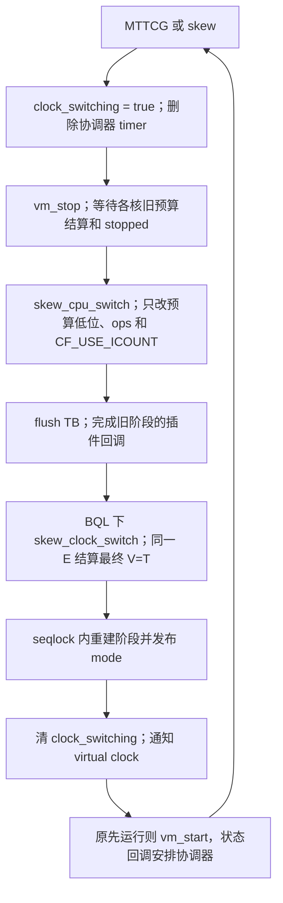

# visible 场景的 MTTCG / skew 双向切换

沿用 `skew-start` / `skew-stop`、永久时钟路由和每核 MTTCG 线程。
模式提交时暂停执行，恢复后继续多核并行，保留 `CF_PARALLEL`。
切换是低频控制操作；正常 getter 保留原有插值和 CAS-max，不登记读者，
不增加共享计数、事件等待或切换专用原子操作。

## 时间契约

切换先停稳全部 vCPU，持有 BQL 后采样一次 `E = cpu_get_clock()`。
用旧 mode/model/anchor/slope 结算最终 visible=T，将新阶段起点也设为 T。
退出采用 visible，不采用 model 或最后一次协调保存的 skew elapsed，
也不把 CPU 已结算但未进入共享时间的领先尾部补进时间。

```text
进入 skew：mttcg_elapsed = T - skew_elapsed
退出 skew：skew_elapsed  = T - mttcg_elapsed
两个方向：mttcg_start_clock = E；start_ns = T
新 MTTCG：V = mttcg_elapsed + skew_elapsed + cpu_get_clock() - E
新 skew：M = T + warp + global_icount * 1e9 / sim_ips
         V 从 T 起按新阶段的锚点和斜率插值
```

两个方向都设置 `model_ns=visible_ns=anchor_visible_ns=T`，两个 elapsed
锚点为 E，斜率和历史数组/位置/数量清零，`prev_global_icount=0`。
`global_icount`、`warp_ns`、每核 raw/base/logical/budget/active/waiting 清零。
这是阶段计数重置；两个模式的累计纳秒量保留。

旧 visible/model 偏差在阶段边界归档，不构成新阶段指令债务。
保证切换本身不跳时、顺序读取不回退；不改变正常协调中的下界校正、
idle warp 或窗口饱和行为，不承诺每次计数器读取严格增加。

## 状态和函数顺序



- `skew_cpu_switch()` 只在停核后调用，断言旧预算已结算；不清通用 high
  退出通知、exit_request 或 interrupt_request。下一 TB 标志清为 -1。
- `skew_clock_switch()` 使用私有 `skew_clock_at(E)`，确保旧阶段结算与
  新阶段 elapsed 起点采用同一个采样；两个方向共用 `skew_momentum_rebase(T,E)`。
- `skew_switch()` 在停核前保持旧 mode，期间拒绝再次切换。
  vm_stop 报错或 I/O drain 期间 VM 离开 paused 状态，保持旧模式并按
  当前 runstate 恢复旧协调器策略。提交后才恢复 VM。
- `skew_vm_state()` 和 `skew_update()` 在 clock_switching 期间不能重新
  安排协调器。已暂停/prelaunch 的 VM 不自动启动。
- 同模式命令返回当前查询，不重置阶段。QMP query 的 virtual/model/
  bias 和累计量保持原有接口。

TB 的退出、中途异常回退、原子重试和 `before_reset` 使用现有公共路径。
旧 mode/预算 ops 保留到 stopped；控制线程不读取运行中剩余预算代结算。
恢复后由 `skew_cpu_prepare()` 加入 active 集合、重建每核逻辑基线并发预算。

## 发布者与切换同步

正常运行时，协调器与 vCPU 仍通过原有 CAS-max 合并 visible 高水位。
切换等待全部 vCPU 停稳，其在途插值和 CAS 已完成；协调器、QMP/QOM 调试
查询和主循环设备调用由 BQL 与重锚阶段串行化。QMP/QOM 可以复用 getter
推进插值，不需要为了切换改成只读。同步成本集中在停核及切换路径。

getter 的调用约束为 vCPU 执行上下文或持有 BQL 的路径。seqlock 保护快照，
不撤销已执行的 CAS；不能把任意 BQL 外独立线程持续发布视作已覆盖的场景。
新的调用者需要遵守上述生命周期约束，不能直接假设停核会停止任意宿主线程。

QEMU_CLOCK_VIRTUAL 和 configured 后的 elapsed ticks 始终走统一 getter；
QEMU_CLOCK_VIRTUAL_RT 保持原生 pause-aware elapsed。设备 timer 绝对
deadline、ARM counter frequency/offset 不调整，切换后通知 virtual clock。

## 验证入口

```sh
ninja -C build qemu-system-aarch64
python3 tests/tcg/aarch64/system/skew-visible-switch.py --build-dir build
python3 tests/tcg/aarch64/system/skew-momentum-anchor.py
python3 tests/tcg/aarch64/system/skew-visible-cas.py
python3 tests/tcg/aarch64/system/skew-check.py build/qemu-system-aarch64 \
    --quick --output build/skew-visible-quick
```

visible-switch 定向测试提取实际 clock/CPU 函数，使用 QEMU 原子和 seqlock。
覆盖正/负 bias、未保存插值、窗口上界、暂停、累计量、CPU 标志/退出高位。
四个发布线程各阶段并发读取，在每次切换边界全部停稳，执行 1000 次转换。
线程屏障仅属于测试夹具；生产 getter 不增加同步。实际 VM 停核、TB unwind、
设备与 ARM System Counter 由 guest 集成测试验证。

旧的带登记实现及其测试/性能结果属于历史版本，不能用于说明当前实现的开销。
本轮移除 `clock_readers`、open/drained 事件、四个登记/关闭辅助函数及所有调用。
保留采样锚点修复和模式切换字段结算，未改变正常阶段的 CAS-max 发布算法。

历史验收和性能记录见[整理前文档](https://github.com/Andy-HNU/qemu_skew_timer/blob/17d49d3d497ce9f2235c739acfedcca7e0a0e086/docs/clock-model/SKEW_VISIBLE_SWITCH_zh.md)。
当前运行应使用新输出目录，并分别执行定向测试和真实 guest 集成测试。
