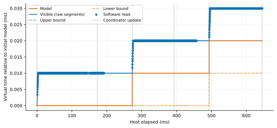
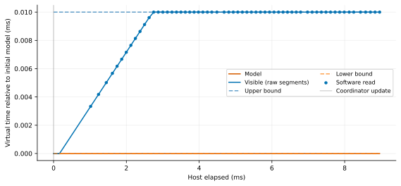

# 实验 5 实测报告：可见时间插值、平台期与 IPS 边界

日期：2026-09-20。代码基线：`4e894601b887007c180d5d28ec12afbba05c0965`。
[预登记与修订计划](PLAN_zh.md) · [实测分组数据](results/20260920/group-summary.csv) ·
[最终逐次审计](results/20260920/audit.json)

**本轮验证了有界插值的基本行为，也发现一项高 IPS 换算缺陷。不能把结果概括为全部通过。**

本报告记录修复前的结果。该缺陷已在后续修复，新增数据与验证见
[修复后回归报告](POST_FIX_zh.md)；下文失败数据保留不覆盖。

## 1. 测了什么，复用了什么

- WSL2 Ubuntu-20.04，x86-64 宿主；完整 CPU/内核信息见各批次 manifest.json。
- 复用现有 `skew-boot.S`、`skew.ld`，裸机执行实际 `CNTVCT_EL0` 读取。
- 复用 Linux 6.1.0-50-cloud-arm64、AF_ALG/jitterentropy 模块和
  `skew-linux-jitter.py`，重新启动并完成 init + 256 次 64 字节读取。
- 复用 `skew-check.py --quick`，重新测试暂停冻结、idle/IRQ、指令计数、双核控制等。
- 不使用旧报告数字作为本轮数据。历史脚本/镜像是复用对象，测试记录全部新采集。

11 个裸机场景，每个 baseline/probe 各 1 次预热 + 7 次正式。
共 **154 次正式运行**、baseline 和 probe 各 **392,000 次 guest 读取**。
所有进程完成且 guest 未报告 counter 倒退；联合轨迹的模型公式检查另有失败，见第 5 节。

正式二进制未改；实验构建只替换两个对象，源文件副本及插桩差异见
[instrumentation.patch](results/20260920/instrumentation.patch)。
正常场景在内存中记录，退出时写文件；饱和场景额外注入读请求延迟。
构建脚本核对正式源码/二进制 SHA-256 未改变。

## 2. 联合轨迹如何采集

ARM 物理/虚拟计数器寄存器回调进入前标记读取，在 `skew_visible_clock()` 中捕获
对应的 model、实际 visible 返回值、global_icount、window、保存的 slope；
回调结束补入真实 counter_ticks。协调发布、idle 重入各记录 update/resume。

这些读回调和事件由已有 BQL 串行化，未新增记录锁；本轮 **0 条丢失、0 次未持 BQL
记录**。host_ns 来自可暂停的 `cpu_get_clock()`，在插值求值之后紧邻采样，存在
记录指令本身的少量时间差。数据不是任意时刻的无扰动快照。

guest counter 频率为 **62.5 MHz**，本裸机环境虚拟 counter offset 为 0：
所有读取均满足 `counter_ticks == visible_ns / 16`（整数除法）。
双核场景用 release/acquire 握手轮流读，形成有因果顺序的跨核检查。

## 3. 单调性、边界与重复读

全部 392,000 次插桩软件读取中：

- counter/visible 倒退：**0**。
- 记录到的 model 倒退：**0**。
- `abs(visible-model) > window`：**0**。
- 斜率超出 `[0, 2^32]`：**0**。
- counter 转换关系不匹配：**0**。

这是本轮有限场景下的观测，不能代替对所有并发交错的证明。

下表重复率为 7 次正式运行的中位数。model 一列是**同一条轨迹中严格模型值的
相邻重复率**，不是另启动一个“关闭插值”二进制的消融实验。

| 场景 | 配置 IPS | model 重复率 | CNTVCT 重复率 | 实测含义 |
|---|---:|---:|---:|---|
| steady | 200M | 99.750% | 22.181% | 常规间隔读取有明显改善 |
| dense | 200M | 100.000% | 94.999% | 极密读取仍大量重复，不能保证每次增长 |
| cross-cpu | 200M | 99.450% | 8.752% | 跨核有序读取，无倒退 |
| burst | 200M | 97.849% | 2.826% | 不均匀计算间隔 |
| sustained-200m | 200M | 47.718% | 0.000% | 长负载、动量进入多周期状态 |
| sustained-2g | 2G | 48.081% | 0.000% | 长负载模型换算正确 |
| saturation-2g | 2G | 99.950% | 98.900% | 人为延迟后命中硬上界，平台期符合预期 |

短 high-2g/high-20g 在首个有效 global 更新前就结束（仅 1 个初始 update）；
因此另加相同长工作量的 200M/2G/20G 三档。长负载每次约 4,157–4,337 个 update，
不能把短负载的启动期斜率当作稳定行为。

差值方差已保存在 group-summary.csv（ns²）。例如 steady：
visible 为 1.338e8，model 为 4.907e8；sustained-2g：3.230e7 对 8.108e8。
但 dense 的 model 方差为 **0**，因为整个观测区间 model 不变；
所以“方差更小”不能单独作为时钟更好的结论。

## 4. 真正触及 window 上界的测试

仅增大协调周期时，CPU 会先用尽预算睡眠，因而预跑没有捕获到 guest 触界读取。
预跑记录保留在 results/20260920/pilots。

明确故障注入配置：

```text
IPS = 2G
window = 10 us
update = 100 ms
4000 reads/run
在 counter 回调前持原有 BQL 等待 100 us/read
```

该等待只存在于实验副本，通过环境变量开启；它阻止协调器在该小段延迟中更新，
让当前斜率可以推进到上界。它是功能压力条件，不代表自然负载性能。

7 次正式运行共 28,000 次读取，**27,699 次命中上界**，其中记录到 **27,678 对**
“model 不变且相邻 visible 同为上界”的读取。所有命中点保存的 slope 仍为正。

因此现有机制的可验证表述是：

> 软件读取时执行 clamp；达到上界后返回值变平；更新 model 后才有继续增长空间。
> 读时撞界不把保存的 slope 置零。可见时钟是有界、非递减的，而不是严格每次递增。





## 5. 发现的真实失败：大于 32 位的 IPS 被截断

`include/qemu/host-utils.h` 中函数签名为：

```c
muldiv64(uint64_t a, uint32_t b, uint32_t c)
```

但 `skew.c` 中 `sim_ips` 为 uint64_t，配置允许到 1e12。
窗口生成把 ips 传到 b，模型时间换算把 ips 传到 c，超过 UINT32_MAX 就发生截断。

对**未插桩正式二进制**做 QMP 配置检查（window=1ms）：

| 配置 IPS | 正确 window 指令数 | QMP 实际 | 结果 |
|---:|---:|---:|---|
| 200,000,000 | 200,000 | 200,000 | 匹配 |
| 2,000,000,000 | 2,000,000 | 2,000,000 | 匹配 |
| 4,000,000,000 | 4,000,000 | 4,000,000 | 匹配 |
| 4,294,967,295 | 4,294,967 | 4,294,967 | 匹配 |
| 4,294,967,296 | 4,294,967 | 拒绝配置 | 截断后为 0 |
| 4,494,967,296 | 4,494,967 | 200,000 | 错误 |
| 20,000,000,000 | 20,000,000 | 2,820,130 | 错误 |

20G 截断后为 **2,820,130,816 IPS**。长 20G 的 7/7 次实测均未通过
`model_ns == global_icount * 1e9 / configured_ips`；
初批 20G 饱和场景也有 7/7 次公式失败。

代表性的 sustained-20g 第 0 次运行中，G>0 的 12,099 个样本：
按配置 20G 计算全部不匹配；按截断值计算全部匹配。
首个样本 G=2,820,130、model=999,999ns，而按20G应约141,006ns。
[公式诊断](results/20260920/ips-formula-diagnosis.json) 保留具体样本与精确复算。

初批 runs.json 的 passed 只覆盖当时的单调/边界/guest 自检。加入严格模型公式后，
对所有旧 CSV 重新审计，**最终以 audit.json 为准**；原始通过标签保留，不覆盖历史。
短 high-20g 因 G 始终为0无法检出模型公式错误，但其配置仍是错误的。

这说明此前“20G/50G 可以启动”的结果只能说明该 workload 完成，不能证明 IPS 生效。
该缺陷仅解释超过32位的配置；对于200M正常而某个小于4.29G配置失败，仍不能仅据此归因。
本轮保留功能代码不变，修复及回归应作为后续独立变更。

## 6. Linux jitter 与已有验收复跑

正式二进制、2 vCPU、2G IPS、1ms window、100us update，全程 skew：

- 1 次预热 + **7/7 次正式 jitter init 通过**。
- 每次 **256 × 64 字节 AF_ALG jitterentropy_rng 实际读取通过**，共1792次正式读取。
- 完整启动/读取宿主耗时约 **9.390–9.992 秒**。
- 原有 quick 验收通过：暂停250ms时钟冻结、全idle无timer稳定、外部IRQ唤醒、
  精确计数、tiny window、配置拒绝、双核控制和timer负载。

相关原始日志在 results/20260920/reuse。此结果不表示 jitter 熵质量已认证；
密集 counter 重复率也不是 jitter 自身健康测试的采样分布。

## 7. 插桩扰动与适用范围

正常短场景，probe/baseline 整进程耗时中位数之比约 **1.02–1.06**；
正常长场景约 **1.00–1.01**。这包含启动、退出及写日志，不能当作单次读时钟成本。
饱和场景主动注入延迟，不计算插桩成本比。

本轮未做独立“关闭插值”消融；未证明所有并发交错无倒退；未验证真实硬件标定；
只测试了这一种 Linux 内核与固定资源环境。无插桩 guest 自检用于交叉验证，
不能让记录工具消除的竞争自动成为实现正确性的证明。

## 8. 复现

先保证项目 build 已完成。在仓库根目录运行：

```sh
python3 paper/experiments/exp5_visible_time/build_probe.py
python3 paper/experiments/exp5_visible_time/run_matrix.py \
  --out build/exp5-new --repeats 7
python3 paper/experiments/exp5_visible_time/run_reuse.py \
  --out build/exp5-reuse-new --repeats 7
python3 paper/experiments/exp5_visible_time/check_ips_boundary.py --out build/exp5-boundary-new
```

`run_matrix.py` 默认现在包含所有11场景；20G模型公式失败是当前版本预期捕获的缺陷，
不要当作脚本失败后删除数据。构建复用已有 Ninja 对象；来源形状变化会明确停止。

本轮目录归档由 archive_results.py 生成；plot_measured.py 读取其中真实 CSV，
输出 SVG/PDF。这两个脚本默认处理本轮固定目录，重新采集时请更换批次路径。
图只绘制第0次正式运行或预先规定的起始时间片，分组统计则使用全部7次。
